# La Máquina — Quantitative Trading System

An independent, single-author quantitative research and paper-trading platform in Python, combining statistical/econophysics feature engineering, ML-based signal filtering, Black-Litterman and genetic-algorithm portfolio construction, and a governance layer that quantifies its own overfitting risk before any strategy is considered for real capital.


> **Full technical whitepaper:** [`docs/whitepaper.pdf`](docs/whitepaper.pdf) — 48 pages covering every formula, file, and design decision referenced below. This README is a condensed, code-facing entry point; the whitepaper is the canonical technical reference (currently in Spanish).

---

## Overview

La Máquina ingests daily OHLCV data from Yahoo Finance, builds a tradeable universe, engineers a set of statistical and signal-processing features, classifies the market regime, models expected returns, filters those signals through a meta-labeling ML layer, estimates a shrunk covariance matrix, blends it with market-implied equilibrium views via Black-Litterman, optimizes the portfolio with a custom genetic algorithm, sizes the resulting exposure through regime-sensitive risk controls, and books everything through a simulated paper-trading engine — with every step logged for governance and overfitting analysis.

The system shares one data/feature core across two operating modes:

- **Research mode** (`financial_data_system.py`) — a diversified pipeline over a broad NASDAQ + core-ticker universe, with Black-Litterman, genetic portfolio optimization, regime gating, and several research variants for ablation studies.
- **Growth Champion Final** (`growth_candidate_paper_trading.py` + `current_growth_feature_generation.py`) — a concentrated, high-conviction strategy (2–4 positions) over a CEDEAR/growth-equity universe, sized via 22%-annualized volatility targeting and a dual SPY/QQQ trend filter. **This is the variant currently in active paper trading.**

The system places **no real orders**, connects to **no broker**, and moves **no real money**. Every run explicitly logs `real_trading: disabled`.

---

## Architecture

```mermaid
flowchart TD
    subgraph S1["1 · Data Ingestion"]
        A1["Yahoo Finance OHLCV<br/>(yfinance)"]
        A2["Local disk cache<br/>yahoo_ohlcv_price_cache/"]
        A1 --> A2
    end

    subgraph S2["2 · Universe & Quality"]
        B1["build_trading_universe<br/>CORE + GLOBAL + NASDAQ (≤250)"]
        B2["growth_universe_quality_filter<br/>liquidity / cap / vol thresholds"]
        B1 --> B2
    end

    subgraph S3["3 · Feature Engineering"]
        C1["quant_research_features<br/>Kalman · FFT · Wavelets · GARCH/EGARCH<br/>Hurst · OU half-life · Hawkes · Entropy<br/>Higuchi · Lyapunov proxy · Hill tail"]
        C2["trend_persistence_engine"]
        C3["market_regime / regime_engine_v2"]
        C1 --> C2 --> C3
    end

    subgraph S4["4 · Expected Return & Signal Quality"]
        D1["expected_returns_model<br/>quant_target_model"]
        D2["triple_barrier_labeling"]
        D3["meta_labeling_framework<br/>ml_core_model (LogReg / RF / GBM)"]
        D1 --> D2 --> D3
    end

    subgraph S5["5 · Risk & Portfolio Construction"]
        E1["covariance_estimation<br/>Ledoit-Wolf shrinkage"]
        E2["black_litterman_model<br/>equilibrium + views"]
        E3["portfolio_optimizer<br/>genetic algorithm"]
        E1 --> E2 --> E3
    end

    subgraph S6["6 · Exposure & Sizing"]
        F1["exposure_control<br/>conviction dispersion"]
        F2["current_growth_feature_generation<br/>22% vol target + dual trend filter"]
        F3["exit_rule_drawdown_guard<br/>soft exit rule"]
        F1 --> F2 --> F3
    end

    subgraph S7["7 · Execution & Governance"]
        G1["final_selected_holdings_sanity_check"]
        G2["action_signals<br/>growth_action_reconciliation"]
        G3["growth_candidate_paper_trading<br/>paper trading engine"]
        G4["anti_overfitting_framework<br/>Deflated Sharpe · PBO proxy"]
        G5["research_governance<br/>promotion checklist"]
        G1 --> G2 --> G3 --> G4 --> G5
    end

    A2 --> B1
    B2 --> C1
    C3 --> D1
    D3 --> E1
    E3 --> F1
    F3 --> G1
    G5 -.->|"status: paper trading only"| H["Real-capital execution — NOT enabled"]
```



**Orchestration.** There is no external scheduler/framework (Airflow, etc.) — two entry points coordinate everything:

| Entry point | Role |
|---|---|
| `daily_research_run.py` | Daily orchestrator: chains the main engine, growth feature generation, growth paper trading, governance, dashboard, and monitor. Logs every run to `daily_research_run_log.csv` and applies **freshness gates** (blocks paper trading if Yahoo data is staler than the forecast history, unless explicitly overridden). |
| `financial_data_system.py` | Main research engine (~3,780 lines): price download, targets, regime, expected returns, covariance, Black-Litterman, optimization, backtest, reporting. |

State (positions, trades, performance) is persisted as **flat CSV files**, not a relational database — a deliberate choice for direct auditability (see [Research Philosophy](#research-philosophy)).

---

## Research

Implemented and tested components, grouped by what they feed into:

**Signal & feature research** (`quant_research_features.py`, `trend_persistence_engine.py`)
- Local-level Kalman filter for smoothed trend extraction
- Savitzky-Golay polynomial slope (tanh-normalized)
- FFT low-frequency spectral energy ratio
- Haar wavelet detail-energy ratio (3-level decomposition)
- GARCH(1,1) and EGARCH(1,1) conditional volatility, estimated by discrete grid search (not continuous MLE)
- Hurst exponent (rescaled-range, lags 2–40 sessions)
- Ornstein-Uhlenbeck mean-reversion half-life
- Hawkes self-exciting intensity for downside tail-event clustering
- Shannon entropy of the return distribution
- Higuchi fractal dimension
- Rosenstein-style Lyapunov exponent proxy
- Hill tail index (fat-tail estimation)
- 2-state Gaussian Hidden Markov Model — **implemented from scratch** (simplified Baum-Welch, 25 iterations), no external HMM library
- Composite `quant_market_quality` score blending five of the above

**Signal quality / meta-labeling** (`triple_barrier_labeling.py`, `meta_labeling_framework.py`, `ml_core_model.py`)
- Triple-barrier labeling (López de Prado)
- Meta-model comparing logistic regression, Random Forest, and Gradient Boosting (scikit-learn) to filter false-positive signals
- Isotonic probability calibration (Zadrozny & Elkan, 2002), including a walk-forward calibrated variant

**Portfolio & risk research** (`covariance_estimation.py`, `black_litterman_model.py`, `portfolio_optimizer.py`)
- Ledoit-Wolf covariance shrinkage (default), with manual diagonal shrinkage as a fallback
- Black-Litterman blending of market-equilibrium returns with model views, used as a **diagnostic** overlay rather than an automatic override
- Custom genetic algorithm optimizer (population 30, elitism, crossover, mutation, stagnation-triggered partial restarts) chosen over an exact quadratic solver because the fitness function combines non-convex penalties (Herfindahl concentration, regime-conditional terms)
- VaR / CVaR, Sortino, Calmar, max drawdown
- Volatility targeting (22% annualized), dual SPY/QQQ 200-day trend filter, and a soft drawdown-based exit rule

**Governance research** (`anti_overfitting_framework.py`, `research_governance.py`)
- Deflated Sharpe Ratio (Bailey & López de Prado, 2014)
- A heuristic Probability-of-Backtest-Overfitting proxy, explicitly labeled as a proxy for the full CSCV method (Bailey, Borwein, López de Prado & Zhu, 2016) — see [Validation](#validation)

The full academic bibliography (30+ references spanning Markowitz, Black-Litterman, Bollerslev/Nelson GARCH, Hurst, Hawkes, Hamilton regime-switching, and more) is in the whitepaper, §22.

---

## Methodology

The system supports five `MODEL_MODE` variants that determine which expected-return source drives decisions:

| `model_mode` | What it does |
|---|---|
| `baseline` | Simple targets (moving average / volatility adjustment), no quant blending |
| `full_quant_research` | Uses the blended quant target price, trend-persistence timing instead of EMA |
| `regime_gated_full_quant` | As above, gated by market regime / VIX-z / breadth |
| `calibrated_forecast_research` | Substitutes a walk-forward, out-of-sample calibrated forecast |
| `raw_target_research` | Uses the raw target return with no discretionary adjustment — **the basis of Growth Champion Final** |

**Decision funnel (Growth Champion Final):**

1. Engineer features and classify regime for the CEDEAR/growth universe.
2. Generate a raw target return and expected-return estimate.
3. Filter through triple-barrier labeling + the meta-labeling classifier to suppress low-quality signals.
4. Estimate a Ledoit-Wolf shrunk covariance matrix and cross-check the resulting ranking against Black-Litterman equilibrium views.
5. Run the genetic optimizer to select 2–4 concentrated positions under soft constraints.
6. Size the position: final exposure = **minimum** of (a) 22%-vol-target sizing, (b) a fixed exposure cap, and (c) the dual SPY/QQQ trend filter — a "defense in depth" design where no single risk layer is trusted alone.
7. Apply the soft exit/drawdown guard, run the final holdings sanity check (splits, gaps, blacklist), and emit buy/sell/hold action signals.
8. Reconcile against the previous day's state and book the result in the paper-trading engine (idempotent — a same-day rerun is skipped unless explicitly overwritten).
9. Compute governance metrics (Deflated Sharpe, PBO proxy, promotion status) on every run, not just at reporting time.

---

## Research Philosophy

Design principles that recur throughout the codebase (see whitepaper §23 for the full rationale table):

- **Auditability over infrastructure.** Flat CSV state instead of a database — any result can be checked by opening a file, at the cost of transactional robustness.
- **Fail loudly, not silently.** Stale or incomplete volatility data requires an explicit `--allow-stale-growth-volatility` override rather than silently sizing positions on outdated numbers.
- **Defense in depth.** Exposure is capped by the *minimum* of three independent controls (volatility targeting, a hard cap, the dual trend filter) — no single layer is assumed infallible.
- **Diagnostics before automation.** Black-Litterman checks the model's conviction ranking against market-implied equilibrium and reports the agreement; it does not silently override the ranking.
- **Governance is part of the pipeline, not a post-hoc report.** Deflated Sharpe and the PBO proxy are computed on every run and logged to `experiment_registry.csv`, not calculated only for the final "winning" backtest.
- **Honesty about the process, not just the outcome.** The system explicitly separates *this configuration's* overfitting proxy (currently low, 0.18) from the *entire research history's* overfitting warning (currently "high," given ~14,600 logged trials) — and does not let a good backtest hide the second number.
- **Prefer transparent, from-scratch implementations where feasible.** The Kalman filter, the 2-state HMM, and the Hawkes intensity are hand-implemented rather than pulled from a black-box library, so every number in the pipeline traces back to an explicit formula.

---

## Project Structure

The repository is a flat collection of independent Python modules (no package framework) plus roughly 500 single-purpose research scripts. The table below groups the **operational core** by responsibility; the full file-by-file map is in the whitepaper, §20.

| Layer | Representative files |
|---|---|
| Orchestration & entry | `daily_research_run.py`, `financial_data_system.py`, `dashboard_app.py` |
| Data & universe | `growth_universe_quality_filter.py`, `final_selected_holdings_sanity_check.py`, `data_freshness_audit.py`, `cedear_universe.csv` |
| Features, regime & modeling | `quant_research_features.py`, `trend_persistence_engine.py`, `market_regime.py`, `regime_engine_v2.py`, `expected_returns_model.py`, `quant_target_model.py`, `triple_barrier_labeling.py`, `meta_labeling_framework.py`, `ml_core_model.py`, `feature_selection_engine.py` |
| Risk & portfolio | `covariance_estimation.py`, `black_litterman_model.py`, `portfolio_optimizer.py`, `exposure_control.py`, `current_growth_feature_generation.py`, `risk_metrics.py`, `exit_rule_drawdown_guard.py` |
| Execution & governance | `action_signals.py`, `growth_action_reconciliation.py`, `growth_candidate_paper_trading.py`, `growth_paper_governance.py`, `anti_overfitting_framework.py`, `research_governance.py`, `experiment_registry.csv` |
| Dashboard & monitoring | `dashboard_app.py`, `research_dashboard.py`, `paper_trading_monitor.py` |
| Research (~500 scripts) | Walk-forward backtests, ablation studies, parameter sweeps, integrity audits. Convention: one script → one self-named output CSV (e.g. `barrier_parameter_optimization.py` → `barrier_parameter_optimization.csv`), so every result traces back to the script that produced it without a separate lineage system. |

> A `src/`-style package reorganization of the ~500 flat scripts is on the [Roadmap](#roadmap) — the current layout above reflects how the project actually exists today, not a target structure.

---

## Validation

Overfitting and leakage control are built into the pipeline itself, not run as an optional post-hoc check.

**Deflated Sharpe Ratio** (`anti_overfitting_framework.py`) adjusts the observed Sharpe for having searched over many configurations, and for the skew/kurtosis of financial returns (which violate the normality assumption behind a raw Sharpe ratio).

**PBO proxy** — an explicitly-labeled heuristic (not the full CSCV method) combining a penalty for number of trials, a robustness-to-perturbation penalty, a sample-size penalty, and an "isolated optimum" penalty into a single overfitting-risk score, bucketed as *safe to research further* (< 0.55), *not enough evidence* (0.55–0.75), or *high risk of overfitting* (≥ 0.75).

**Promotion checklist** (`research_governance.py`) — a strategy must simultaneously satisfy **all** of the following before it can even be considered for real-capital promotion. No strategy has cleared this bar; the system runs exclusively in paper mode.

| Criterion | Threshold |
|---|---|
| Sample size (observations) | ≥ 100 |
| Independent out-of-sample windows | ≥ 4 |
| Deflated Sharpe Ratio | ≥ 0.50 |
| PBO proxy | ≤ 0.30 |
| Robustness score | ≥ 60 / 100 |
| Turnover | ≤ 1.00 |
| Research-wide overfitting warning = "high" | **Automatically blocks promotion** |

Currently: the winning Growth Champion configuration shows a PBO proxy of 0.18 and Deflated Sharpe of 1.63 — but the research-wide warning across ~14,600 logged trials remains "high," which alone keeps promotion blocked. That distinction is treated as a feature of the governance design, not a bug to explain away.

Other current safeguards: walk-forward, out-of-sample forecast calibration (isotonic regression); a train/test split respecting chronological order; automatic risk flags on rolling Sharpe, drawdown, turnover, and concentration. **Not yet implemented:** purged k-fold cross-validation with embargo (López de Prado, 2018) — see [Roadmap](#roadmap).

---

## Results

*All figures below are backtested or paper-traded simulations, reconstructed from the system's own logged output (`final_champion_report.txt`, `reconstructed_growth_governance.csv`). They are not live trading results and are not a guarantee of future performance.*

**Reference backtest — current "Growth Champion Final" configuration** (n = 847 observations):

| Metric | Value |
|---|---|
| Cumulative return (sample) | 21.32% |
| Annualized volatility | 14.07% |
| Sharpe | 1.64 |
| Sortino | 2.13 |
| Calmar | 4.51 |
| Max drawdown | -5.50% |
| Avg. exposure / avg. cash | 45.1% / 54.9% |
| Turnover | 0.70 |
| Deflated Sharpe | 1.63 |
| PBO proxy | 0.18 |
| Governance classification | *"Eligible for paper trading only"* |

**Long-horizon reconstruction (2008–2026), by start window, vs. SPY/QQQ CAGR:**

| Start | Cumulative return | CAGR | Ann. vol | Sharpe | Sortino | Calmar | Max DD | SPY CAGR | QQQ CAGR |
|---|---|---|---|---|---|---|---|---|---|
| 2008-01-01 | +1,568% (16.7x) | 17.5% | 19.3% | 0.96 | 1.47 | 0.50 | -34.7% | 14.7% | 20.8% |
| 2010-01-01 | +969% (10.7x) | 16.6% | 19.3% | 0.92 | 1.38 | 0.44 | -37.7% | 14.1% | 19.1% |
| 2015-01-01 | +741% (8.4x) | 22.7% | 22.6% | 1.05 | 1.55 | 0.57 | -40.1% | 15.4% | 21.1% |
| 2020-01-01 | +229% (3.3x) | 24.5% | 30.0% | 0.91 | 1.74 | 0.46 | -53.0% | 15.4% | 18.1% |
| 2022-01-03 | +427% (5.3x) | 62.3% | 33.4% | 1.67 | 3.02 | 2.11 | -29.6% | 23.4% | 36.2% |

This is a **causal reconstruction** (uses only OHLCV available at each decision date, no look-ahead) but is explicitly *not* an exact replica of the current production logic (`exact_production_parity = False`) — the target return is reconstructed via a momentum proxy rather than the full feature pipeline in §4–7, since that pipeline cannot be reconstructed causally with the cached data available that far back. Read it as evidence of directional robustness across regimes (2008 GFC, 2011 euro crisis, 2018 sell-off, 2020 COVID, 2022 bear market, 2024 AI rally), not as parity validation.

Across the 19 calendar years covered (2008 partial–2026 partial), 16 closed positive and 3 negative (2008 partial, 2011, 2022) — an 84% annual hit rate, consistent with a 57.2% reported daily hit rate. The strategy finished positive through the 2008–09 financial crisis window but posted double-digit losses during the 2011 euro crisis, the 2018 sell-off, the 2020 COVID crash, and the 2022 bear market — expected for a trend/volatility-reactive design that responds to observed conditions rather than anticipating sudden shocks.

---

## Reproducibility

```bash
git clone https://github.com/Santiago-Pasqual/<repo-name>.git
cd <repo-name>
python -m venv .venv && source .venv/bin/activate   # Windows: .venv\Scripts\activate
pip install -r requirements.txt

# Run the full daily research + paper-trading pipeline
python daily_research_run.py

# Or run only the main research engine, selecting a mode:
MODEL_MODE=raw_target_research python financial_data_system.py

# Local read-only dashboard (Streamlit, falls back to Flask)
streamlit run dashboard_app.py
```

Notes:
- The pipeline is **daily-frequency**; running it more than once on the same calendar day is idempotent by default (the second run is skipped) unless `--overwrite-same-day` is passed.
- `daily_research_run.py` applies **freshness gates**: if Yahoo Finance data is newer than the cached forecast history, the run blocks paper trading unless explicitly overridden.
- All state is plain CSV under the project root — no database setup required.
- Yahoo Finance is the sole data source; see [Disclaimer](#disclaimer) and the whitepaper §24.1 for the data-dependency limitations that follow from that.

---

## Roadmap

From the whitepaper's own future-research section (§25), plus repo-hygiene items added while setting up this README/CI:

**Statistical rigor**
- [ ] Replace the heuristic PBO proxy with the full CSCV method (Bailey, Borwein, López de Prado & Zhu, 2016)
- [ ] Add purged k-fold cross-validation with embargo (López de Prado, 2018) across all walk-forward processes
- [ ] Migrate GARCH/EGARCH from grid search to continuous MLE (e.g. via the `arch` package), enabling parameter confidence intervals
- [ ] Extend the 2-state Gaussian HMM to more states / non-Gaussian emissions for finer-grained regimes
- [ ] Evaluate non-linear covariance shrinkage (Ledoit & Wolf, 2020) as an extension of the current linear shrinkage

**Data & infrastructure**
- [ ] Add a second, institutional-grade market-data source for cross-validation of prices and corporate-action adjustments
- [ ] Automate CEDEAR↔underlying mapping maintenance (currently semi-manual)
- [ ] More realistic paper-trading microstructure (non-linear market impact, order-size-dependent slippage) instead of the current simplified cost/slippage assumptions

**Modeling & portfolio**
- [ ] Extend the market-regime engine to a formal multivariate regime-switching model (e.g. Markov-Switching VAR) instead of threshold rules
- [ ] Extend Black-Litterman to non-diagonal, relative "pairs" views in addition to current absolute per-asset views
- [ ] Define and automate an explicit paper-to-production exit criterion beyond the current checklist, including broker/custody/reconciliation procedures

**Engineering**
- [ ] Reorganize the ~500 flat scripts into a proper `src/` package layout (`data/`, `features/`, `portfolio/`, `execution/`, `governance/`)
- [ ] Expand automated test coverage now that CI is in place (unit tests for feature calculations, regression tests against the CSV artifacts)
- [ ] Publish an English translation of the technical whitepaper

---

## Disclaimer

La Máquina is an independent research project built and maintained by a single author for educational and research purposes. It does not place real orders, does not connect to any broker, and does not manage real capital — every result in this repository is a backtest or a paper-trading simulation. Historical and simulated performance is not indicative of future results, and nothing in this repository, the whitepaper, or this README constitutes financial, investment, or trading advice. The system's own governance layer currently classifies every evaluated configuration as *"eligible for paper trading only"*; no strategy has cleared the checklist for real-capital promotion (see [Validation](#validation)).

## License

No open-source license is currently attached to this repository — all rights are reserved by the author. Add a `LICENSE` file (e.g. MIT, Apache-2.0, or an explicit proprietary notice) before publishing if you want to define reuse terms.
